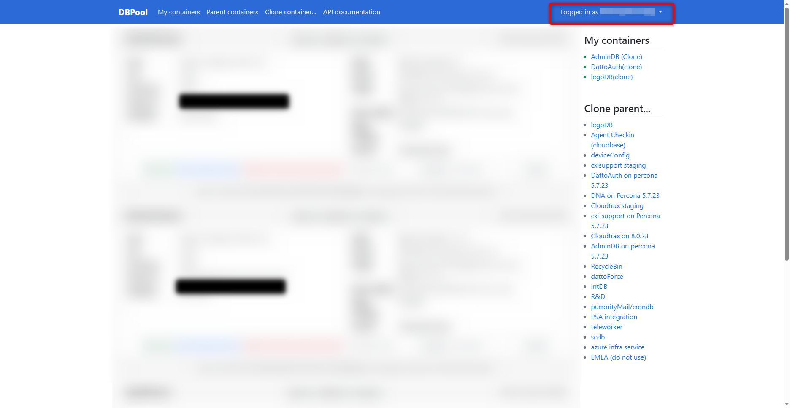
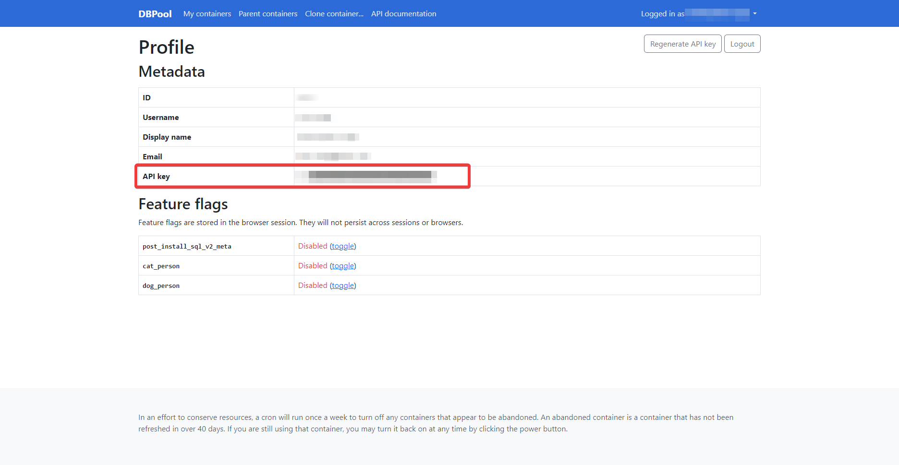

# DBPool_Refresh

 PowerShell script to `Refresh` all child containers in Datto (Kaseya) DBPool, this can be combined with Scheduled Tasks in Windows or a Cron job to automate the refresh script on a set interval. The recommended is ~30 mins. prior to the start of your shift.

## Script

This section will detail parts of the PowerShell script and give a high-level overview of the logic. If you would like to make any suggestions, **Pull Requests** are always welcome. :smiley:

### API Key

This will detail how to get your personal API key, which will be needed by the script to refresh your containers.
First login to the web-portal https://dbpool.datto.net

1. Select your **User Profile** at the top-right, select **My profile** from the drop-down
   
2. Under **Profile** -> **Metadata** -> **API key**, listed is your personal API key
   Make a record of this in a safe-place.
   

### Environment Override

The script is configured to check for an `override.env` file in the root directory of the PowerShell script, this is also a user configurable env. variable within the script.
If the environment override file exists, then the script will pull included variables into the script rather than as for them at run.
The standard here is `$_.envName=$_.envValue` for example `url="https://dbpool.datto.net/api/v2/containers"`

## Automating

